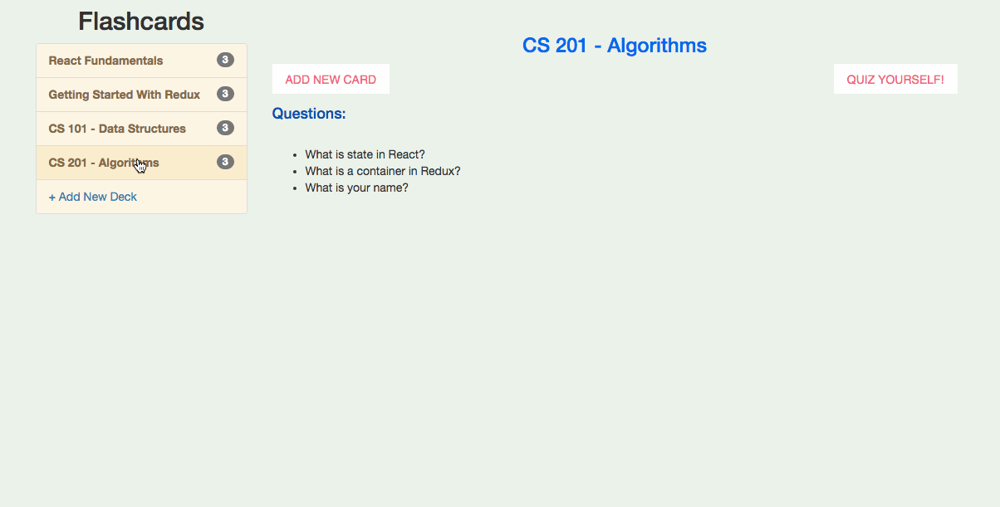
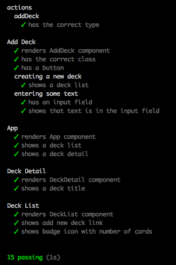

# Flashcard App

Single-page flashcard application to help you study!

### Video

### Getting Started

    npm install

### To Start Server

    npm run dev

Go to:

    http://localhost:8080

### To Run Unit Tests

    npm test

or,

    npm run test:watch

### Notes on Process

1. I learned you have to return state in its original form, for example, if it's an object with keys that contain more objects, make sure you're returning new state in exactly this form; otherwise you might run into error where container is receiving `undefined` state and component does not get re-rendered.

2. Similarly, sometimes when you pass a payload with 2 objects, you might have to put it in 1 object as a wrapper

### Tech Stack

    React
    Redux
    ES6
    Node.js
    Babel
    Mocha
    Chai
    Webpack
    Bootstrap
    Material-ui
